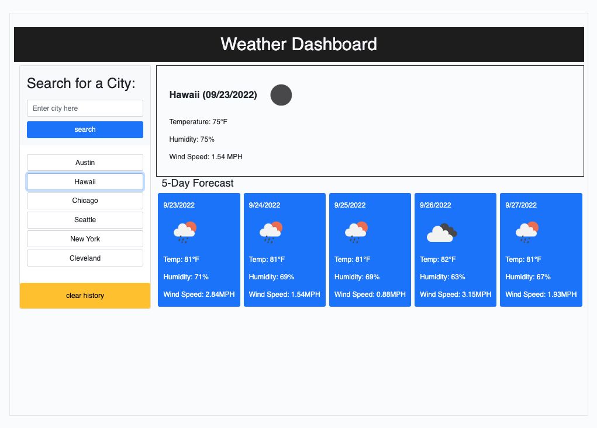

Weather Dashboard

The Weather Dashboard web link: https://xiaojing168jmg168.github.io/weather-dashboard/

User Story
As a traveler
I want to see the weather outlook for multiple cities
So I can plan my trip accordingly

Description:
This is a weather dashboard with form inputs that will run in the browser.
The weather Dashboard is an application to find the current weather conditions and a 5-day outlook for the target city chosen by the user.
The "current weather section" includes the following display criteria:

. City, Date, Icon-image
. Temperature
. Humidity
. Wind Speed

The 5-Days weather forecast displays the following information for each day:

. Date
. Icon image
. Temperature
. Humidity
. Wind Speed

The local storage is also used to store the previous search city and display them under the "search" button.
If the user wants to see the past search city weather condition again, they just click that city from list group. The user can also clear the search history by clicking the "clear history" button.

Screenshots:
